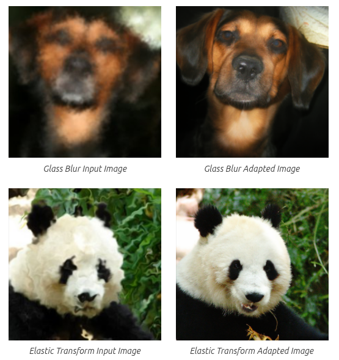

<div align="center">
<h2>Discriminator-Guided Adaptive Diffusion for Source-Free Test-Time Adaptation under Image Corruptions</h2>

<p>
  Francesco Olivato, 
  <a href="https://scholar.google.com/citations?user=VmjUxckAAAAJ&hl=en">Cigdem Beyan</a>,   
  <a href="https://scholar.google.com/citations?user=yV3_PTkAAAAJ&hl=en">Vittorio Murino</a> 
</p>

</div>

> **Abstract.** In this work, we study Source-Free Unsupervised Domain
Adaptation under corruption-induced domain shifts, where performance
degradation is caused by natural image corruptions that go beyond addi-
tive noise, including blur, weather effects, and digital artifacts. We pro-
pose a diffusion-based, input-level adaptation framework that operates
entirely at test time and keeps all source-trained models frozen, explicitly
targeting robustness to corrupted target inputs. Our method leverages
a source-trained diffusion model as a generative prior and introduces a
discriminator-guided adaptive diffusion strategy that dynamically con-
trols the amount of perturbation applied to each test sample. Rather
than relying on a fixed diffusion depth, the discriminator determines, on
a per-image basis, when sufficient forward diffusion has been applied to
suppress corruption-specific artifacts, with each corruption type effec-
tively defining a distinct target domain. This adaptive stopping mech-
anism applies only the necessary amount of noise to remove domain-
specific corruption while preserving class-discriminative structure. The
reverse diffusion process then reconstructs a source-aligned image, op-
tionally stabilized through structural guidance, which is classified using
a frozen source-trained classifier. We evaluate the proposed approach
across a broad spectrum of corruption-induced target domains, covering
15 diverse corruption types, and demonstrate more balanced robustness
with competitive or improved performance across non-noise corruptions.
Additional analyses reveal how the adaptive diffusion schedule responds
to different corruption characteristics, highlighting the practicality, gen-
erality, and robustness of the proposed framework.
<center></center>
<!-- > <center></center> -->


### Install Dependencies
Create the environment and install dependencies via mamba:

```bash
mamba env create -f environment.yml
mamba activate dgadiffusion
```
ℹ️ Note: We used a Single NVIDIA GTX 4090 for the experiments.

### Pretrained model
You can download the pretrained models used in our experiments [here](https://drive.google.com/file/d/1PIvnXeiCTjJq1DXZrdhr2xdArdZRMtND/view?usp=sharing):

- our trained discriminator checkpoints
- the unconditional 256x256 diffusion model checkpoint used in our experiments

You can train your own discriminator by using the main training script (see [Training](#training) section). 

### Get the Datasets
Download the original source dataset (e.g., ImageNet validation set) and the target corrupted dataset (e.g., ImageNet-C).

### Project Structure
```text
dgadiffusion
├─ checkpoints/
├─ guided_diffusion/
├─ images/
├─ dataset.py
├─ dataset_reconstruction.py
├─ environment.yml
├─ eval_reconstruction.py
├─ main.py
├─ model.py
├─ README.md
└─ utils.py
```

You have to clone the repo [`guided-diffusion`](https://github.com/openai/guided-diffusion) to your local machine (as seen in project structure).

The checkpoints you downloaded must be placed under the `checkpoints` folder.

### Experiment Tracking
This project uses Weights & Biases (WandB) for experiment tracking. Make sure to login to WandB before running the training script.

### Training
The discriminator is trained to distinguish between noisy images originating from the target domain and noisy images drawn from the source distribution, effectively solving a binary classification task to identify domain-specific artifacts under varying levels of diffusion noise. 

To train the discriminator, you can run the main training script. (Update with specific training arguments if needed):
```bash
python main.py \
    --wandb_entity <wandb_entity> \
    --dataset_source_dir <path_to_source_dataset> \
    --dataset_target_dir <path_to_target_dataset> \
    --dataset_target_domains <target_domain_1,target_domain_2,...> \
    --lr 0.00002 \
    --batch_size 64 \
    --epochs 5
```

### Testing and Evaluation
At test time, the forward diffusion process is applied to generate a sequence of noisy representations. The pretrained discriminator monitors residual domain-specific cues and adaptively halts noising at the first timestep where its confidence drops below a predefined threshold. The subsequent reverse diffusion reconstructs a source-aligned image while minimizing semantic distortion.

To evaluate the adaptation on a specific target domain using this discriminator-guided adaptive stopping mechanism, use the `eval_reconstruction.py` script.

Based on the paper, the optimal configuration uses the `custom` evaluation type and a discriminator threshold of `0.5`. 

Run the following command, replacing the `<...>` placeholders with your specific paths and target domains:

```bash
python eval_reconstruction.py \
    --batch_size 8 \
    --dataset_target_domains <target_domain> \
    --eval_type custom \
    --checkpoint_path <path_to_checkpoint> \
    --dataset_source_dir <path_to_source_dataset> \
    --dataset_target_dir <path_to_target_dataset> \
    --disc_threshold 0.5
```

**`<target_domain>` options for ImageNet-C:**
`gaussian_noise`, `shot_noise`, `impulse_noise`, `defocus_blur`, `glass_blur`, `motion_blur`, `zoom_blur`, `snow`, `frost`, `fog`, `brightness`, `contrast`, `elastic_transform`, `pixelate`, `jpeg_compression`.

#### Some Qualitative Examples
<center></center>

### Citation  
Please cite this work as follows if you find it useful:
```bibtex
@article{olivato2025dgadiffusion,
  title={Discriminator-Guided Adaptive Diffusion for Source-Free Test-Time Adaptation under Image Corruptions},
  author={Olivato, Francesco and Beyan, Cigdem and Murino, Vittorio},
  year={2025}
}
```
